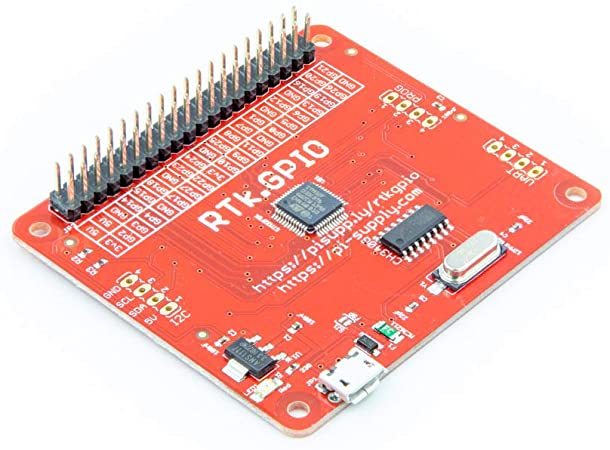

# RTk.GPIO C++ Interface Library

This is a C++ interface library for controlling the RTk.GPIO board.
The board provides a RaspberryPi like GPIO interface to computers via a USB to Serial chip.
This API is not officially supported and has been developed from my own interest only.

RTk.GPIO boards are available from [https://pi-supply.com](https://pi-supply.com).



The Rtk.GPIO board is based on the `STM32F030C8T6` microcontroller and the `CH340G` USB serial adapter.


----
## Available APIs

This library provides two separate C++ APIs for controlling the RTk.GPIO board:
- A gpio interface ([gpio.h](gpio.h)).
- A WiringPi interface ([WiringPi.h](WiringPi.h), [WiringPiSPI.h](WiringPiSPI.h)).

Both are very similar and in fact the WiringPi interface is implemented entirely using the gpio interface.
The WiringPi interface provides a subset of the WiringPi API and was added simply to make it easy to port software between platforms.
Not all WiringPi functions are available however due to limitations of the RTk.GPIO board, so it will not work for all applications.

Just pick which one you prefer.


---
## RTK.GPIO pin header

The GPIO pinout is as follows:
```
pin1                    3v3  ||  5v
         W8   PB7   ft  GP2  ||  5v
         W9   PB6   ft  GP3  ||  GND
         W7   PA8   ft  GP4  ||  GP14  --  PA2   W15
                        GND  ||  GP15  --  PA3   W16
         W0   PB15  ft  GP17 ||  GP18  --  PB1   W1
         W2   PB14  ft  GP27 ||  GND
         W3   PA11  ft  GP22 ||  GP23  ft  PB2   W4
                        3v3  ||  GP24  ft  PB3   W5
         W12  PA7   --  GP10 ||  GND
         W13  PA6   --  GP9  ||  GP25  ft  PB4   W6
         W14  PA5   --  GP11 ||  GP8   ft  PB5   W10
                        GND  ||  GP7   ft  PF1   W11
         W30  PA1   --  GP0  ||  GP1   ft  PB12  W31
         W21  PA12  ft  GP5  ||  GND
  swdio  W22  PA13  ft  GP6  ||  GP12  ft  PF0   W26
  swclk  W23  PA14  ft  GP13 ||  GND
         W24  PA15  ft  GP19 ||  GP16  ft  PB8   W27
         W25  PB0   --  GP26 ||  GP20  ft  PB9   W28
                        GND  ||  GP21  ft  PB10  W29       pin40
```

Where:
- `fv` - 5v tolerant (all others are 3v3 only).
- `swdio`, `swclk` - debug interface.
- `Pn` - STM32 pin number.
- `pin1`, `pin40` - PI interface pin numbers.
- `Wn` - WiringPi numbers.


---
## The RTk.GPIO protocol

The RTk.GPIO boards use a very simple ascii based protocol operating at `230400` baud.
Because of the serial based nature of the interface its not possible to operate at high speeds.

In all cases the computer acts as a master issuing commands, and the RTk board operates as a slave, acting on received commands.

GPIO pins are identified using lower case letters beginning with `"a"` which represents GP0, `"b"` which represents GP1, etc.

A pin number is followed by a command to inform the interface to perform an action.
Examples of supported commands are as follows:

- `"aO"` instructs the interface to make the GP0 pin an output (low impedance).
- `"bI"` instructs the interface to make the GP1 pin an input (high impedance).
- `"c0"` drives the GP2 pin to logic level low.
- `"d1"` drives the GP3 pin to logic level high.
- `"e?"` reads the current logic level on the GP4 pin (see below).
- `"fU"` pull GP5 pin to logic level high.
- `"gD"` pull GP6 pin to logic level low.
- `"hN"` turn off GP7s pull up or pull down resistor.
- `"V"` print board firmware version.

Notes:
- The `?` command will produce a response from the board in the following format `"x0\r\n"` or `"x1\r\n"` where `"x"` is the pin being read.
- If an output pin is read from, it will return its current driving logic level.


---
## External References

- [RTk.GPIO board firmware](https://bitbucket.org/ryanteckltd/rtk.gpio-mcu-firmware/src/development/)
- [STM32F030C8T6 Datasheet](https://www.mouser.co.uk/datasheet/2/389/dm00088500-1797910.pdf)
- [RTKGPIO Python API](https://github.com/RyanteckLTD/RTk)
