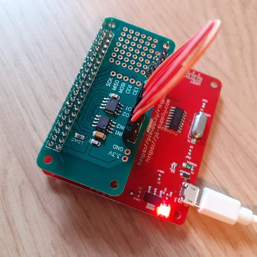
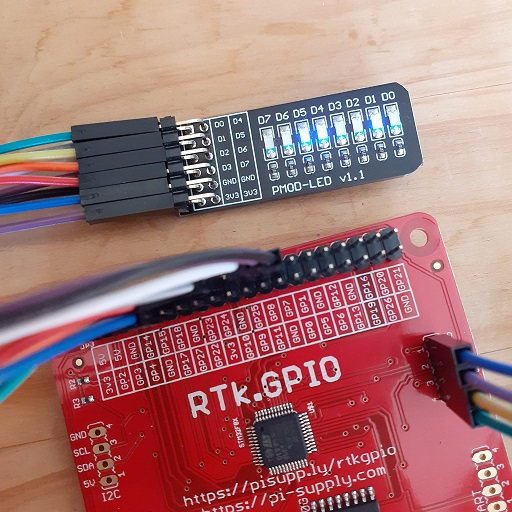

# RTk.GPIO C++ Interface Examples

----
## DAC/ADC example

This example shows how to interface the RTk.GPIO board to a Digital to Analogue and Analogue to Digital converter board.
The RaspberryPi hat being used in this example is the `ADC-DAC Pi Zero` hat from PiSupply and can be found [here](https://uk.pi-supply.com/products/adc-dac-pi-zero).

The board features:
- a two channel 12bit MCP3202 ADC.
- a two channel 12bit MCP4822 DAC.

This example shows how values are output from the DAC and read values are from the ADC using the SPI interface. Multiple chip select pins are used in this example.

The code can be browsed [here](dac_adc/main.cpp).

----
## LEDs example

This basic example shows how to use the RTk.GPIO board to drive 8 LEDs.
For this example a PMOD adapter with 8 LEDs was used, with the LEDs lighting up when their input is driven low.

The code can be browsed [here](leds/main.cpp).
