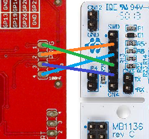
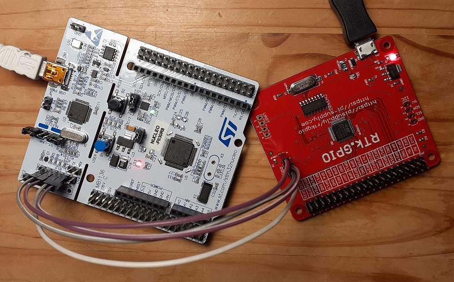
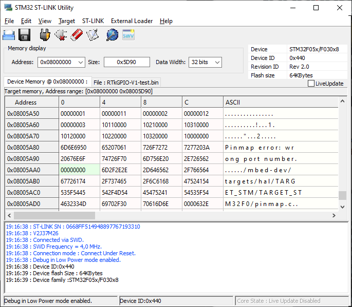

# RTk.GPIO firmware


----
## Development environment

The updated firmware was created with the online version of [keil studio](studio.keil.arm.com).
A compatible development target was chosen, being the NUCLEO-F030R8 board, which shared a similar processor to the RTk.GPIO board.  The RTk.GPIO board uses the STM32F030C6 chip (48 pin package), where as the Nucleo board uses the STM32F030R8 chip (64 pin package).  As long as we correctly specify the pins to use, compatibility is maintained.

This updated firmware uses the mbed framework as did the original.


----
## Programming headers

It is possible to upload new firmware to the device using an stm32nucleo board which has a builtin ST-LINK programmer.  I was unsuccessfull when trying to use a ST-LINK dongle however.

RTk.GPIO programming header:
```
1 - SWDIO  (GP6)
2 - SWCLK  (GP13)
3 - Reset  (RST)
4 - GND
```

stm32nucleo SWD (NUCLEO-F030R8) CN4 header:
```
1 -
2 - SWCLK
3 - GND
4 - SWDIO
5 - Reset
6 -
```



Note: The IDD jumper on the Nucleo should be closed to keep that MCU active.  This needs investigation as to why.




----
## Code upload

Code can successfully be uploaded using the STM32 ST-LINK utility.




----
## Pin header functions

The GPIO pinout and alternate functions are as follows:
```
GP0  | PA1  |    |           |           |                    |
GP14 | PA2  |    | USART2_TX |           |                    |
GP15 | PA3  |    | USART2_RX |           |                    |
GP11 | PA5  |    |           | SPI1_SCK  |                    |
GP9  | PA6  |    |           | SPI1_MISO | TIM3_CH1           |        
GP10 | PA7  |    |           | SPI1_MOSI | TIM3_CH2           |        
GP4  | PA8  | ft |           |           |                    |
     | PA9  |    | USART1_TX |           |                    |
     | PA10 |    | USART1_RX |           |                    |
GP22 | PA11 | ft |           |           |                    |
GP5  | PA12 | ft |           |           |                    |
GP6  | PA13 | ft |           |           |                    | swdio
GP13 | PA14 | ft |           |           |                    | swclk
GP19 | PA15 | ft |           |           |                    |
GP26 | PB0  |    |           |           | TIM3_CH3           |
GP18 | PB1  |    |           |           | TIM3_CH4 TIM14_CH1 |
GP23 | PB2  | ft |           |           |                    |
GP24 | PB3  | ft |           | SPI1_SCK  |                    |
GP25 | PB4  | ft |           | SPI1_MISO | TIM3_CH1           |
GP8  | PB5  | ft |           | SPI1_MOSI | TIM3_CH2           |
GP3  | PB6  | ft |           |           |                    |
GP2  | PB7  | ft |           |           |                    |
GP16 | PB8  | ft |           |           | TIM16_CH1          |
GP20 | PB9  | ft |           |           | TIM17_CH1          |
GP21 | PB10 | ft |           |           |                    |
GP1  | PB12 | ft |           |           |                    |
GP27 | PB14 | ft |           |           |                    |
GP17 | PB15 | ft |           |           |                    |
GP12 | PF0  | ft |           |           |                    |
GP7  | PF1  | ft |           |           |                    |
```
